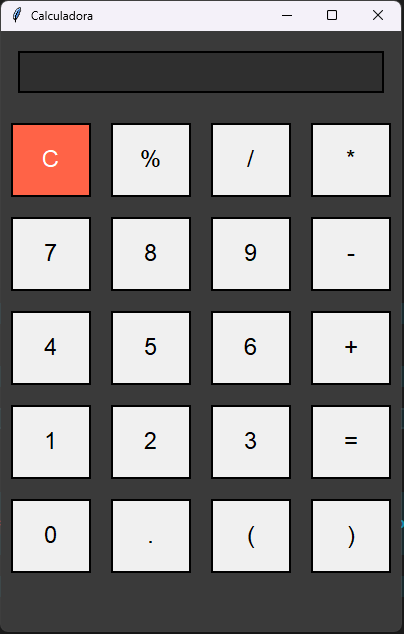

# 🧮 **Calculadora Gráfica em Python** 💻

Seja bem-vindo ao repositório da **Calculadora Gráfica em Python**! 🚀 Este projeto utiliza a biblioteca **Tkinter** para criar uma interface gráfica simples e moderna, permitindo realizar cálculos matemáticos de forma rápida e intuitiva. Ideal para iniciantes que desejam aprender sobre interfaces gráficas e manipulação de entradas em Python.

---

## 💡 **Objetivo**

Este projeto foi desenvolvido para demonstrar a criação de uma **calculadora simples**, mas poderosa, com funcionalidades básicas como adição, subtração, multiplicação, divisão, e cálculos mais complexos, como porcentagens e uso de parênteses.

- **Fácil de usar** para qualquer pessoa que precise realizar cálculos rápidos.
- **Interface gráfica** moderna e atrativa usando **Tkinter**.
- **Ideal para iniciantes** no Python que querem aprender sobre **GUIs** e **lógica de programação**.

---

## 🎯 **Funcionalidades**

✔️ **Operações matemáticas básicas**: soma, subtração, multiplicação e divisão.

✔️ **Suporte a parênteses**: para cálculos mais avançados.

✔️ **Porcentagem**: calcule porcentagens facilmente.

✔️ **Limpar tela**: pressione "C" para limpar a tela a qualquer momento.

✔️ **Interface moderna e limpa**: design simples, mas eficaz.

---

## 🎨 **Visual do Aplicativo**

**Aqui está uma captura de tela da Calculadora Gráfica em Python:**


## ⚙️ **Tecnologias Usadas**

- Python 🐍

- Tkinter (para a interface gráfica GUI)

- Avaliação de expressões matemáticas com a função eval()

## 🚀 **Como Usar**

1. **Clone o repositório** ou baixe o código para seu computador:
   
   ```bash
   git clone https://github.com/seuusuario/calculadora-python-tkinter.git

## 📄 **Licença**
Este projeto está licenciado sob a licença MIT. Veja o arquivo LICENSE para mais informações.
